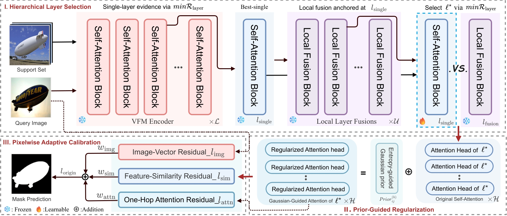

# [CVPR 2026] Selective, Regularized, and Calibrated: Harnessing Vision Foundation Models for Cross-Domain Few-Shot Semantic Segmentation

Official implementation of our CVPR 2026 paper [Selective, Regularized, and Calibrated: Harnessing Vision Foundation Models for Cross-Domain Few-Shot Semantic Segmentation](https://arxiv.org/abs/2605.19340)

<p align="center">
  <strong>
    <a href="https://arxiv.org/abs/2605.19340">Paper</a> |
    <a href="https://zhiyuan624.github.io/HERA-CDFSS/">Project Page</a> |
    <a href="https://github.com/Zhiyuan624/HERA-CDFSS">Code</a>
  </strong>
</p>

<p align="center">
  
</p>

The proposed **HERA** harnesses vision foundation models for cross-domain few-shot semantic segmentation through selective feature extraction, regularized adaptation, and calibrated attention refinement. It dynamically identifies task-relevant representations from intermediate layers, integrates complementary multi-level features, and improves prediction reliability under severe domain shifts while requiring only a few annotated support examples.


## Data Preparation
We evaluate HERA on the standard cross-domain few-shot semantic segmentation benchmarks. 

The source-domain dataset follows the conventional CD-FSS setting, while HERA is evaluated directly on the target domains without source-data retraining.

### Source Domain

#### ▸ PASCAL VOC 2012
&emsp;PASCAL VOC 2012 is commonly used as the source-domain dataset in CD-FSS.

- **Official Website:** [PASCAL VOC](http://host.robots.ox.ac.uk/pascal/VOC/)
- **Train/Val Archive:**

```bash
wget http://host.robots.ox.ac.uk/pascal/VOC/voc2012/VOCtrainval_11-May-2012.tar
```

- **SDS Extended Mask Annotations:** [Google Drive](https://drive.google.com/file/d/10zxG2VExoEZUeyQl_uXga2OWHjGeZaf2/view?usp=sharing)

### Target Domains

#### ▸ DeepGlobe
&emsp;DeepGlobe is a satellite-image segmentation dataset with substantial variations in texture, scale, and spatial layout.

- **Official Website:** [DeepGlobe](http://deepglobe.org/)
- **Download:** [Kaggle](https://www.kaggle.com/datasets/balraj98/deepglobe-land-cover-classification-dataset)

#### ▸ ISIC 2018
&emsp;ISIC 2018 contains dermoscopic skin-lesion images with irregular boundaries and low-contrast foreground regions.

- **Official Website:** [ISIC 2018 Challenge](http://challenge2018.isic-archive.com/)
- **Download (must login):** [ISIC Archive](https://challenge.isic-archive.com/data#2018)
- **Class Information:** `data/isic/class_id.csv`
- **Preprocessing References:** [DR-Adapter repository](https://github.com/Matt-Su/DR-Adapter)

#### ▸ Chest X-ray
&emsp;The Chest X-ray contains radiographic images and lung masks with substantial grayscale and structural variations.

- **Dataset Description:** [NCBI](https://www.ncbi.nlm.nih.gov/pmc/articles/PMC4256233/)
- **Download:** [Kaggle](https://www.kaggle.com/datasets/nikhilpandey360/chest-xray-masks-and-labels)

#### ▸ FSS-1000
&emsp;FSS-1000 is a large-scale few-shot segmentation dataset containing 1,000 object categories from natural images.

- **Official Repository:** [FSS-1000](https://github.com/HKUSTCV/FSS-1000)
- **Download:** [Google Drive](https://drive.google.com/file/d/16TgqOeI_0P41Eh3jWQlxlRXG9KIqtMgI/view)


## Pretrained Models and Benchmark Results

### Models
The default implementation uses **DINOv3 ViT-L/16** ([Download from Google Drive](https://drive.google.com/file/d/1Oni-R5xIDFv1-QcIFOoeJ1iG8ciS4Rv4/view?usp=sharing)) as the vision foundation model.

After downloading, place the checkpoint in the `checkpoints/` directory.

```text
checkpoints/
└── dinov3_vitl16_pretrain_lvd1689m-8aa4cbdd.pth
```

### Performance
The following results are reported using DINOv3 under the standard 1-shot and 5-shot CD-FSS evaluation protocols.

| Target Dataset | 1-Shot mIoU | 5-Shot mIoU |
|:--------------:|:-----------:|:-----------:|
| DeepGlobe      | 44.6%       | 63.4%       |
| ISIC 2018      | 61.2%       | 73.6%       |
| Chest X-ray    | 85.8%       | 87.9%       |
| FSS-1000       | 81.6%       | 86.7%       |
| **Average**    | **68.3%**   | **77.9%**   |


## Dataset Organization
After downloading and preprocessing the datasets, organize them using the following structure:

```text
HERA-CDFSS/                                           # project root
|── codes/                                            # source code
├── data/                                             # datasets
│   ├── VOC2012/                                      # source dataset: PASCAL VOC 2012
│   │   ├── JPEGImages/
│   │   └── SegmentationClassAug/
│   │
│   ├── DeepGlobe/                                    # target dataset: DeepGlobe
│   │   ├── 01_train_ori/                             # original data
│   │   ├── ...
│   │   └── 04_train_cat/                             # processed data
│   │       ├── 1/                                    # category
│   │       │   └── test/
│   │       │       ├── origin/                       # images
│   │       │       └── groundtruth/                  # masks
│   │       └── ...
│   │
│   ├── ISIC/                                         # target dataset: ISIC 2018
│   │   ├── ISIC2018_Task1-2_Training_Input/          # images
│   │   │   ├── 1/                                    # category
│   │   │   └── ...
│   │   ├── ISIC2018_Task1_Training_GroundTruth/      # masks
│   │   └── class_id.csv
│   │
│   ├── LungSegmentation/                             # target dataset: Chest X-ray
│   │   ├── CXR_png/                                  # images
│   │   └── masks/                                    # masks
│   │
│   └── FSS-1000/                                     # target dataset: FSS-1000
│       ├── ab_wheel/                                 # category
│       └── ...
│
└── checkpoints/                                      # pretrained model checkpoints
    └── dinov3_vitl16_pretrain_lvd1689m-8aa4cbdd.pth
```

## Environment Setup
To set up your environment, execute the following commands:
```bash
conda create -n hera python=3.10 -y
conda activate hera

pip install torch==2.8.0 torchvision==0.23.0 torchaudio==2.8.0
pip install scipy pandas matplotlib seaborn
pip install opencv-python scikit-image safetensors timm tensorflow tensorboardX
```

## Run the Code
HERA follows a **source-free test-time adaptation** setting and does not require separate source-domain training.

Please ensure that the target dataset and DINOv3 checkpoint are properly prepared before running the code.

We use DeepGlobe as an example below. More evaluation commands are provided in `scripts.sh`.

Run the 1-shot evaluation on DeepGlobe:

```bash
CUDA_VISIBLE_DEVICES=0 python main_hera.py \
  --test_datapath ./data/deepglobe \
  --backbone DINOv3 \
  --benchmark deepglobe \
  --fold 0 \
  --nshot 1 \
  --refine always \
  --fusion on \
  --feat_id 12 13 14 15 16 17 18 19 20 21 22 23 \
  --attn_strategy dual_attn_gauss \
  --logdir ./logs/deepglobe \
  --logfile Dinov3_deepglobe_shot1.txt
```

Run the 5-shot evaluation on DeepGlobe:

```bash
CUDA_VISIBLE_DEVICES=0 python main_hera.py \
  --test_datapath ./data/deepglobe \
  --backbone DINOv3 \
  --benchmark deepglobe \
  --fold 0 \
  --nshot 5 \
  --refine auto \
  --fusion on \
  --feat_id 12 13 14 15 16 17 18 19 20 21 22 23 \
  --attn_strategy dual_attn_gauss \
  --logdir ./logs/deepglobe \
  --logfile Dinov3_deepglobe_shot5.txt
```

The same evaluation pipeline can be applied to other target datasets by updating `--benchmark`, `--test_datapath`, `--logdir`, and `--logfile`.

> Evaluation performance may vary slightly across random seeds, GPU devices, software environments, and dataset preprocessing implementations.

## Citation
If you find HERA useful in your research, please cite our paper:

```bibtex
@inproceedings{ma2026selective,
  title     = {Selective, Regularized, and Calibrated: Harnessing Vision Foundation Models for Cross-Domain Few-Shot Semantic Segmentation},
  author    = {Ma, Junyuan and Xiang, Xunzhi and Li, Wenbin and Fan, Qi and Gao, Yang},
  booktitle = {Proceedings of the IEEE/CVF Conference on Computer Vision and Pattern Recognition},
  pages     = {12385--12395},
  year      = {2026}
}
```

## Acknowledgement
Our codebase is built upon the official implementations of [DR-Adapter](https://github.com/Suke-ming/DR-Adapter) and [SSP](https://github.com/fanq15/SSP). We sincerely thank the authors for releasing their valuable code and providing a solid foundation for the development of this project.

We also thank [PATNet](https://github.com/slei109/PATNet) and other FSS and CD-FSS works for their valuable contributions to this research community.
